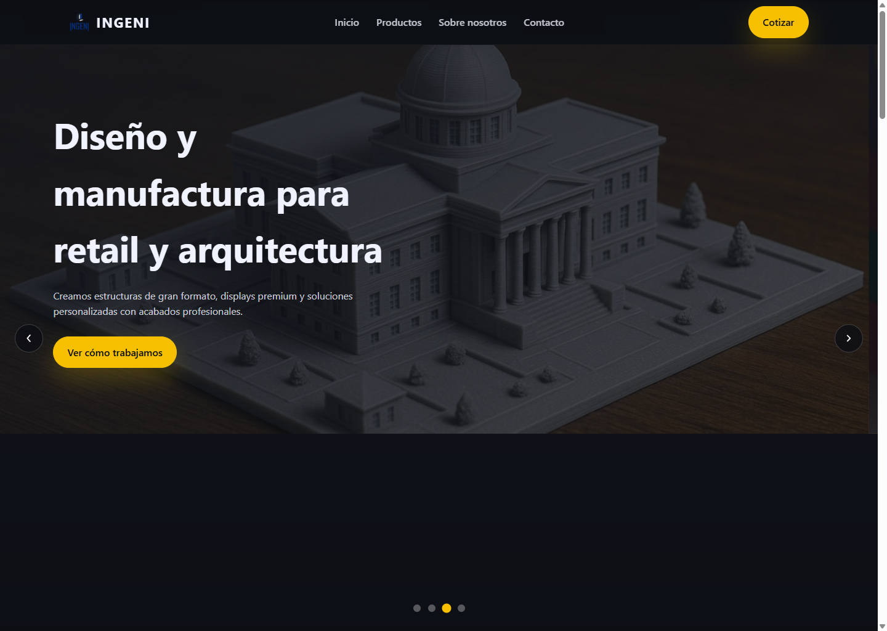
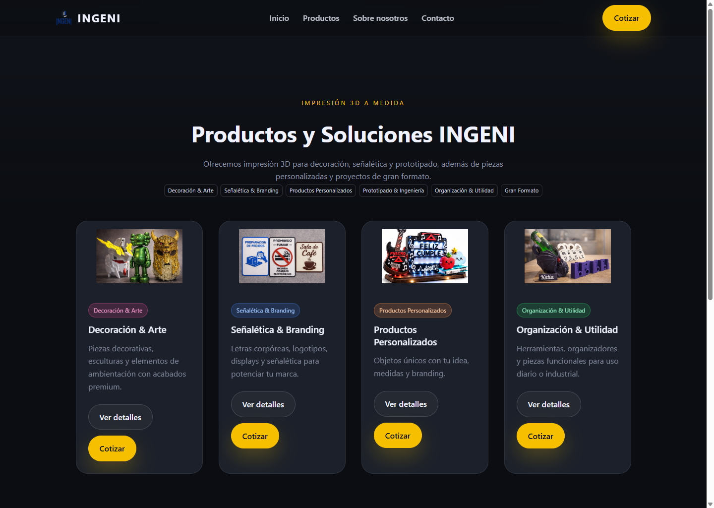
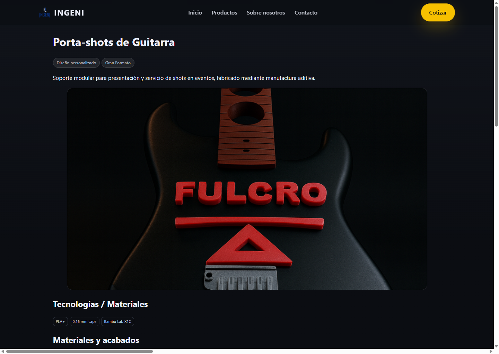
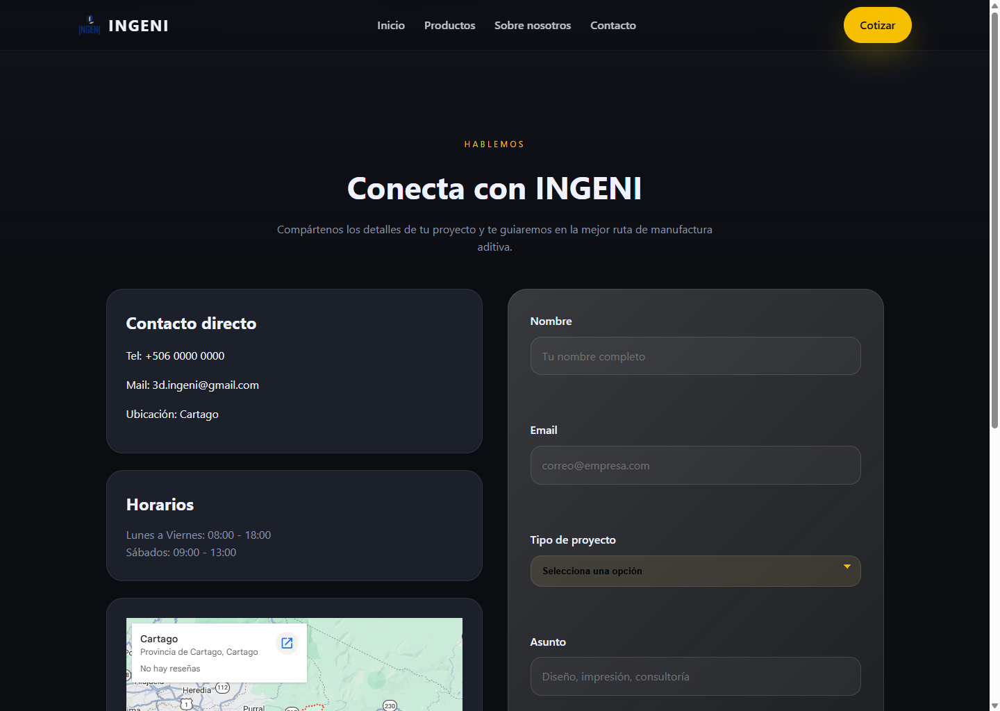

# INGENI

Plataforma web desarrollada con Django para presentar servicios de impresion 3D, catalogo de soluciones personalizadas y proyectos destacados de manufactura aditiva.

## Resumen

Este proyecto funciona como sitio comercial y portafolio digital para INGENI. Reune una landing page orientada a conversion, un catalogo visual de soluciones, casos de estudio con galerias e informacion tecnica, y un formulario de contacto para captar oportunidades.

## Lo mas relevante del proyecto

- Landing page comercial con narrativa visual y secciones enfocadas en conversion.
- Catalogo de productos y servicios con llamadas a la accion para cotizacion.
- Paginas de detalle para proyectos reales con materiales, proceso, desafios y resultado.
- Panel privado para administrar proyectos destacados.
- Manejo de imagenes y media para mostrar galerias de trabajo.
- Base lista para despliegue con Django, SQLite y configuracion por variables de entorno.

## Mi enfoque en este proyecto

- Estructure una experiencia web clara para mostrar servicios y proyectos de impresion 3D.
- Organice contenido comercial y tecnico en una interfaz facil de recorrer.
- Modele una base administrable para que el portafolio pudiera crecer sin rehacer el sitio.
- Mantuve separacion entre vistas publicas, activos estaticos y contenido editable.

## Stack

- Python
- Django
- SQLite
- HTML Templates
- CSS
- JavaScript

## Capturas

### Landing principal



### Catalogo de soluciones



### Caso de estudio



### Formulario de contacto



## Arquitectura del proyecto

- `ingeni/core/`: modelos, formularios, vistas y logica principal.
- `ingeni/TEMPLATES/`: plantillas publicas y del panel privado.
- `ingeni/static/`: estilos, JavaScript e imagenes estaticas.
- `ingeni/media/`: archivos subidos para galerias de proyectos.
- `ingeni/ingeni/`: configuracion global del proyecto Django.

## Puesta en marcha local

```bash
python -m venv .venv
.venv\Scripts\activate
pip install -r requirements.txt
cd ingeni
python manage.py migrate
python manage.py runserver
```

La aplicacion queda disponible en `http://127.0.0.1:8000/`.

## Variables de entorno

Crea `ingeni/.env` para separar configuracion y credenciales sensibles. Variables relevantes:

- `DJANGO_SECRET_KEY`
- `DJANGO_DEBUG`
- `DJANGO_ALLOWED_HOSTS`
- `DATABASE_URL`
- `DJANGO_EMAIL_HOST`
- `DJANGO_EMAIL_PORT`
- `DJANGO_EMAIL_USE_TLS`
- `DJANGO_EMAIL_HOST_USER`
- `DJANGO_EMAIL_HOST_PASSWORD`
- `DJANGO_DEFAULT_FROM_EMAIL`
- `DJANGO_CONTACT_EMAIL`

## Comandos utiles

```bash
cd ingeni
python manage.py createsuperuser
python manage.py collectstatic
python manage.py test
```

## Nota para portafolio

Las capturas incluidas en este repositorio muestran unicamente la interfaz publica del proyecto. Antes de publicar nuevas imagenes, conviene revisar que no expongan datos sensibles, credenciales o informacion interna.
